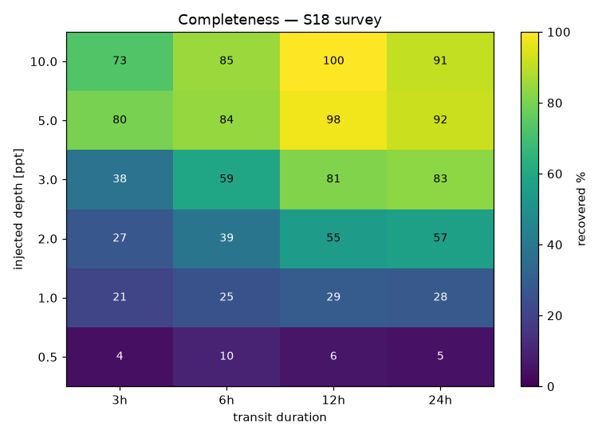

# monohunter

Find single long-period **mono-transits** in public TESS light curves — the
single-transit events that periodic pipelines (SPOC/QLP, which fold on a period)
structurally under-find. Built so many people can each search under-covered
targets and combine machine-readable finds.

[](https://pypi.org/project/monohunter/)
[](https://colab.research.google.com/github/Rinkia/monohunter/blob/main/notebooks/monohunter_quickstart.ipynb)

**New here? Run it in your browser — no install.** The
[quickstart notebook](notebooks/monohunter_quickstart.ipynb) installs monohunter in
Colab, recovers a known single transit to prove it works, then scans any star you
pick. Open it with the badge above.

## Why

Automated TESS pipelines run periodic searches (BLS/TLS) over every target.
A single transit has no period to fold on, so those searches miss it. Real
long-period planets have been co-discovered exactly here (e.g. TOI-2180 b, found
from one ~24-hour transit). monohunter targets that gap.

## Install

```bash
pip install monohunter
```

Python 3.10+. Pulls in lightkurve, wotan, astroquery, scipy, matplotlib. The
ASAS-SN ground cross-check needs one extra: `pip install monohunter[ground]`.

### Or run it with Docker (no Python setup)

```bash
docker run --rm -v monohunter-data:/data ghcr.io/rinkia/monohunter \
    run --tic 298663873 --sectors 19
```

The container runs as a **non-root** user, so it persists to a Docker **named volume**
(`monohunter-data` above — Docker makes it writable by that user). A plain
`-v "$PWD/data:/data"` bind mount is root-owned on the host and needs a one-time
`chown 10001 data` to be writable. For an always-on fresh-data watcher (ideal on a
homelab), `docker compose up -d` runs `monohunter watch-loop` on the newest sector in a
resumable, self-healing loop — see [`docker-compose.yml`](docker-compose.yml). To run that
watcher in the cloud, deploy it to **Fly.io** with the included [`fly.toml`](fly.toml) —
see [docs/deploy-fly.md](docs/deploy-fly.md).

## Usage

Search one target by its TESS Input Catalog (TIC) id:

```bash
monohunter run --tic 298663873
```

This searches every available sector, and for each candidate writes a JSON
find-record + a diagnostic PNG into `candidates/`. Example (TOI-2180, the
canonical mono-transit — restrict to its sector to keep it quick):

```bash
monohunter run --tic 298663873 --sectors 19
# S19: depth=4.09ppt dur=24h SNR=39.4  [known TOI-2180.01] -> candidates/tic298663873_s19.json
```

### Options

| Flag | Default | Meaning |
|------|---------|---------|
| `--tic <id>` | required | TESS Input Catalog id to search |
| `--sectors <n...>` | all | restrict to specific sector numbers (faster) |
| `--window <days>` | `3.0` | detrend window; must be **several × the transit duration** or flattening eats the dip |
| `--outdir <path>` | `candidates` | where JSON + PNG are written |
| `--no-plot` | off | skip PNG generation |
| `--ffi` | off | extract from the Full-Frame Images via TESScut — reaches stars with **no** pre-made SPOC/QLP light curve |
| `--dry-run` | off | list the sectors available for the TIC and exit (no download/detect) |

### Reading a result

Each candidate is one JSON file:

```json
{
  "schema_version": 7,
  "tic": 298663873,
  "sector": 19,
  "cadence_s": 120,
  "event_time_btjd": 1830.77,
  "depth_ppt": 4.09,
  "duration_hr": 23.8,
  "ingress_hr": 2.29,
  "snr": 39.4,
  "tool_version": "0.3.0",
  "known_toi_match": true,
  "known_toi_id": "TOI-2180.01",
  "likely_eb": false,
  "period_constrained": true,
  "p_best_d": 856.0,
  "p_lo_d": 396.0,
  "p_hi_d": 1946.0,
  "next_window_btjd": [3200.0, 3245.0, 3290.0],
  "n_sectors_observed": 1,
  "recurring_dip": false,
  "measured_period_d": null,
  "edge_gap_dist_d": 6.4,
  "baseline_scatter_ppt": 0.21,
  "plot_path": "candidates/tic298663873_s19.png"
}
```

The two v7 fields are false-positive-triage features computed from the light curve:
`edge_gap_dist_d` (distance to the nearest sector edge / data gap — FP ramps cluster
there) and `baseline_scatter_ppt` (per-cadence scatter; faint/noisy stars give
untrustworthy shallow dips). They let the triage model rank survivors on any sector.

| Field | Meaning |
|-------|---------|
| `event_time_btjd` | dip center, TESS Barycentric Julian Date |
| `depth_ppt` | transit depth (parts per thousand), trapezoid flat-bottom |
| `duration_hr` | total transit duration (first-to-last contact) |
| `ingress_hr` | ingress/egress time from the trapezoid fit (`null` if uncharacterized) |
| `snr` | detection signal-to-noise; the tool reports candidates at SNR ≥ 7 |
| `known_toi_match` / `known_toi_id` | whether the target is an existing TESS Object of Interest |
| `likely_eb` | too deep / V-shaped for a planet — flagged as a likely eclipsing binary (labelled, not rejected) |
| `p_best_d`, `p_lo_d`, `p_hi_d` | single-transit period estimate + range (see Next-transit ephemeris) |
| `n_sectors_observed`, `recurring_dip` | multi-sector context: dips in >1 sector flag a periodic/variable star |
| `measured_period_d` | exact period fitted from multiple transit times, when the target recurs across sectors |

**Always look at the PNG.** SNR alone lies — confirm the marked dip is a real,
centered transit, not a sector-edge ramp, a data gap, or a single bad cadence.
Re-run with a different `--window`; a real dip survives, an artifact moves or
vanishes. A `known_toi_match: false` is the interesting case (potentially
unsearched); `true` still validates the tool.

**A candidate is not a discovery.** It means a human thinks the dip is real.
Confirming a planet needs follow-up (radial velocity, more transits) beyond this
tool.

## How it works

```
fetch      search TESS, dedup sectors (prefer 2-min), quality-mask (hard),
           stream one sector at a time
   |
detrend    wotan biweight; window must be >> transit or the dip is flattened away
   |
detect     matched-filter box scan (non-periodic — finds a SINGLE transit),
           red-noise-aware SNR + 7 false-positive guards (edge / gap / scatter /
           momentum-dump ramps)
   |
characterize   trapezoid fit -> true depth, duration, ingress; EB flag
   |
cross-match    flag known TESS Objects of Interest (NASA Exoplanet Archive)
   |
ephemeris      period + next-transit window (single-transit, or exact from
           multiple sectors); multi-sector recurrence flag
   |
FindRecord     versioned + validated JSON  ->  candidates/
```

The `Detector` interface is a seam: v1 is the box scan; a GP-based detector
(`nuance`) can plug in later without touching the pipeline. The versioned
`FindRecord` JSON is the contract a future aggregation server consumes.

## Reuse, not reinvention

Stands on [lightkurve](https://docs.lightkurve.org),
[wotan](https://github.com/hippke/wotan), scipy, and astroquery. monohunter is
orchestration + the single-transit gap + result aggregation, not a new detection
engine.

## Fresh-data watcher (be first)

Institutional pipelines take weeks-to-months to vet a new TESS sector. Run the
watcher on a schedule and you process a sector within hours of its release — and
a single transit you flag comes with a next-transit window (see below) an
observer can still act on.

```bash
monohunter watch --sector 90 --max 100 --out watch_out --state watch_state.json
```

Each run scans the next `--max` un-processed targets of the sector and prints any
not-yet-known candidates. It's **resumable**: state tracks which TICs are done,
so scheduled runs continue where the last stopped and a crash loses nothing.

Schedule it to keep chewing through the sector:

```bash
# Linux/macOS cron — every 2 hours
0 */2 * * * cd /path/to/monohunter && monohunter watch --sector 90 --max 200

# Windows: Task Scheduler → run the same command on a trigger
```

Point `--sector` at the newest released sector. Candidates land in `watch_out/`;
vet each with `monohunter run --tic <id> --sectors <N>` to get its PNG, then
submit the good ones (see Contributing).

**Reproducible sweeps.** `watch` *is* the sweep tool — resumable, parallel, and
it logs provenance. For a full sector sweep:

```bash
monohunter watch --sector 17 --max 5000 --workers 3 --max-hours 5 \
    --summaries summaries_s17 --csv-log sweeps/sector17.csv
```

**Safety net for long runs.** Every network read is capped (a 180 s socket timeout),
`watch` prints live per-star progress with elapsed/ETA, and `--slow-warn S` flags any
star taking longer than `S` seconds — a stall short of the hard timeout is visible
instead of a silent freeze. `--max-hours` is the wall-clock watchdog: it soft-warns at
80 % of the cap, then force-exits (a hung MAST socket can wedge a worker indefinitely).
It's resumable — re-run to continue where it stopped. Preview a sweep without downloading
anything via `monohunter watch --sector N --dry-run` (pool size + done/remaining).

`--csv-log` appends one status row per star (`none`/`novel`/`error`) — the
scan-log a catalog and any retry build from. A star that errors (usually a
transient MAST hiccup) is logged **and left un-processed**, so simply re-running
the same command retries only the failures — no manual cleanup. `--summaries`
writes the rotation/variability catalog from the same downloads.

## Next-transit ephemeris

When a candidate's target has a catalog stellar density, monohunter estimates the
period from the transit duration and predicts when the next transit could occur:

```
S19: depth=4.09ppt dur=24h SNR=39.4  [known TOI-2180.01]
    P~856d (396-1946d, P_min 15d), next transit ~2027-08-07
```

Single-transit periods are inherently uncertain (a range, not a precise value) —
the output is a targeting window for follow-up, not a confirmed ephemeris. If the
stellar density is missing or too uncertain, monohunter reports the period as
unconstrained rather than guessing.

**Multi-sector sharpens both.** A target that dips in more than one sector is
flagged `recurring_dip` (periodic/variable, not a clean mono-transit), and once
it transits in ≥3 sectors the exact period is fitted from the transit times
(`measured_period_d`) — vastly tighter than the single-transit range.

**Is it observable? `observe`** turns a next-transit window into concrete
"target-up **and** sky-dark" clock-time intervals for an observer's latitude/longitude —
so you know whether, and *when*, to point a telescope. Coordinates come from `--ra/--dec`
or a `--tic` (fetched from MAST); the window from `--start/--end` or straight from a
candidate record:

```bash
monohunter observe --record contributions/Rinkia/tic400048097_s17.json --lat 45.19 --lon 9.16
#   TIC 400048097 ...: 2026-08-28 21:00 UTC -> 2026-08-29 03:30 UTC  (6.5h)  ...
```

Tune with `--min-alt` (default 30°) and `--sun-alt` (−18° astronomical / −12° nautical).
Astropy only — no extra dependency.

## More commands

**Anomaly detection** — a suite of non-transit light-curve anomaly classes on the same
downloads, each reported per sector with a generalized 0–1 anomaly score:

```bash
monohunter anomaly --tic 441420236     # AU Mic: flares detected
```

| Detector | Flags |
|----------|-------|
| **flares** | sharp positive brightenings |
| **dippers** | aperiodic multi-dip young stars (dust) |
| **deep dimming** | deep (%-level) *aperiodic* dips — Boyajian / KIC 8462852-like |
| **heartbeat** | eccentric-binary tidal pulse, once per orbit (phase-localized + bipolar) |
| **outbursts** | sustained (hours+) brightenings — cataclysmic-variable / nova |
| **anomaly score** | model-agnostic 0–1 "weirdness" blend, with a component breakdown |

These flags (plus `anomaly_score`) are also written into the per-star summary catalog
(see below), so a full sweep surfaces the strangest curves for a human to look at.

**FFI reach** — extract from the Full-Frame Images to search stars with no
pre-made light curve. One target (`run --ffi`), or a whole cutout at once:

```bash
monohunter ffi-batch --tic <center> --sector 14   # every catalog star in one cutout
```

**Ground cross-check** — is a candidate's host quiet over years, or a variable
star / eclipsing binary? Confirm against ZTF or ASAS-SN:

```bash
monohunter ground --tic 198382838 --survey ztf     # or --survey asassn
```

**Eclipsing-binary periods** — an EB with two or more eclipses in one sector has a
recoverable orbital period. `eb` finds the eclipse times, splits primary from
secondary by depth, and fits the period from the **primary** times (their spacing
is exactly one orbit):

```bash
monohunter eb --tic 271763138 --sectors 15
# S15: 2 eclipses (1 primary) (primary+secondary) -> period needs >=2 same-type eclipses
```

A lone primary+secondary pair is left unrecoverable on purpose — on an eccentric
orbit the secondary sits at an unknown phase, so the primary-secondary gap is not
a period fraction. The tool never reports a confident wrong period.

**Rotation / variability catalog** — the same download that feeds the transit scan
also yields a per-star rotation period, variability amplitude, flare count, and a
sub-class. `summarize` writes one JSON per star; `catalog` aggregates them:

```bash
monohunter summarize --tic 100010286              # rotation/variability/flares/dipper + subclass
monohunter catalog --summaries summaries --out catalog.csv
```

The `subclass` field splits variables into **eclipsing** (≥2 eclipse-shaped dips),
**rotator** (non-sinusoidal spot modulation), and physical pulsator classes —
**rr_lyrae** (large-amplitude sawtooth), **delta_scuti** (fast, < 0.3 d), **gamma_dor**
(slow g-mode, 0.3–3 d) — via periodogram harmonics + fold shape. Each catalog row also
carries the anomaly flags (`anomaly_score`, `is_deep_dipper`, `n_outbursts`,
`is_heartbeat`) from the same download.

Write one line per star to a single file with a `.jsonl` `--summaries` / `--outdir`
target — one open instead of thousands of tiny JSONs when building a big catalog.
**Repopulate an existing catalog** (e.g. to backfill new fields) by re-summarizing every
star it lists, in parallel and resumably:

```bash
monohunter summarize --from-catalog catalogs/sector18.csv --outdir summaries_s18 \
    --workers 4 --max-hours 6      # progress per star; watchdog + --slow-warn as in watch
```

**Rotation-period distribution** — a population science figure straight from a
catalog CSV: the period distribution and the period–amplitude relation over every
rotator in the sweep:

```bash
monohunter rotation-plot --csv catalogs/sector15.csv --sector 15 --out rotation.png
```

**Faster sweeps** — `watch` (and the sweep scripts) take `--workers N` for
parallel MAST downloads (network-bound; keep it modest, 4-8).

**Crowd vetting + triage** — turn a pile of candidates into a labelled queue,
then rank future survivors by how much they deserve a human's eyes:

```bash
monohunter vet --candidates candidates --out _vet      # static page: PNGs + label buttons
monohunter triage-train --labels labels/seed_labels.csv --sweeps sweeps
monohunter triage --candidates candidates --top 10     # ranks by P(worth vetting)
```

The vetting page exports labels as JSON; those labels train the triage model,
which then puts the real finds at the top of the next sweep's queue. `--top N`
(and `--min-prob P`) trims the ranked output to the short-list worth a human's time.

**Novelty cross-match** — is a find already a known variable star? Cone-matches against
both the AAVSO Variable Star Index (VSX) **and** Gaia DR3 variability; a candidate is
"novel" only when unknown to both:

```bash
monohunter novelty --tic 298009554                     # or --candidates <dir> to batch
```

**FFI star pool** — enumerate the non-SPOC stars in a sky region (catalog stars with no
2-min light curve) and sweep them via the FFI path — a true FFI sweep:

```bash
monohunter ffi-pool --tic <center> --sector 18 --radius 0.2 --out ffi_pool.txt
monohunter watch --sector 18 --ffi --target-pool ffi_pool.txt
```

**Cache hygiene** — a truncated MAST download leaves a corrupt partial FITS that can wedge
a later run; sweep them (exact-size stubs) with `monohunter clean-cache` (`--dry-run` to
preview).

## Survey sensitivity (completeness)

A find list without a sensitivity function is a hobby list; with one it is a survey.
`completeness` injects synthetic box transits across a depth × duration grid into real
light curves and runs the full detect pipeline on each, measuring the recovered
fraction — what the survey would have caught, and what it would have missed.



Sector 18, mean over 10 quiet stars: ~50% complete at **2–3 ppt** for long (12–24 h)
transits and ~90% by **5 ppt**, while sub-1 ppt dips are largely missed. Reproduce (or
plot your own sector) with:

```bash
monohunter completeness --sample 10 --catalog catalogs/sector18.csv --sector 18 \
  --n 10 --plot completeness_s18.png
```

## Community leaderboard (swarm)

Submitted candidates are aggregated into one ranked list — deduped by
`(tic, sector)`, ranked by novelty (not a known TOI), cross-submitter agreement,
and SNR. Live at **https://rinkia.github.io/monohunter/**, rebuilt automatically
on every merged contribution.

Vetted candidates worth follow-up (RV, characterization, a second transit) are
tracked in [docs/followup-targets.md](docs/followup-targets.md) — currently led by
**TIC 400048097**, a bright, uncatalogued star with one clean 2.5% transit.

### Confirmation tracking (`followup`)

A candidate is not a discovery until it's confirmed. `followup` tracks that lifecycle —
`pending → observing → confirmed | rejected` — as git-friendly per-target JSON records in
[`followups/`](followups/), so the community can see what's pending, being observed,
confirmed, or ruled out. It's the outcome side of `observe`: observe says *when to point*,
followup records *what happened*.

```bash
monohunter followup add --tic 400048097 --sector 17 \
    --from-record contributions/Rinkia/tic400048097_s17.json --status observing --note "watching next window"
monohunter followup set --tic 400048097 --sector 17 --status confirmed --note "2nd transit caught 2026-08-29"
monohunter followup list --status observing
```

`add` seeds the TIC, sector, and next-transit window from a candidate record; `set`
applies a validated status transition with a dated note and observer; `list` shows the
ledger. The three live targets ship pre-seeded. Extend it by PR, like `contributions/`.

Build it yourself from a `contributions/` tree:

```bash
monohunter aggregate --contributions contributions --out _site
# writes _site/index.html + _site/leaderboard.json
```

This is phase 1 of the swarm: pure aggregation over the PR flow, no backend. A
live coordination server (handing out targets so no two people search the same
star) is a later increment, worth building only once there's real contention.

One-time to publish: repo **Settings → Pages → Source = "GitHub Actions"**
(the `pages.yml` workflow does the rest).

## Contributing

Found a candidate, or want to improve the detector? See
[CONTRIBUTING.md](CONTRIBUTING.md).

- **No git? Use the issue form.** Open a
  [Submit a candidate](https://github.com/Rinkia/monohunter/issues/new?template=candidate.yml)
  issue — fill in the TIC, sector, stats, drag in the PNG, tick the vetting boxes.
  A maintainer turns a complete submission into a leaderboard entry.
- **Comfortable with git?** Candidate submissions go to
  [`contributions/<username>/`](contributions/) via the
  [candidate PR template](https://github.com/Rinkia/monohunter/compare?template=candidate.md).

## Development

```bash
git clone https://github.com/Rinkia/monohunter
cd monohunter
python -m venv .venv && . .venv/Scripts/activate   # Windows
pip install -e ".[dev]"
pytest -q                 # fast, offline unit tests
pytest --runslow          # + live real-data regression (hits MAST)
```

## Releasing to PyPI

CI (`.github/workflows/ci.yml`) runs the tests on every push. Publishing
(`.github/workflows/release.yml`) fires on a version tag and uses **Trusted
Publishing** — no token in GitHub.

One-time PyPI setup (before the first release):

1. On PyPI: Account → Publishing → **Add a pending publisher**:
   - PyPI project name: `monohunter`
   - Owner: `Rinkia`  ·  Repository: `monohunter`
   - Workflow: `release.yml`  ·  Environment: leave blank (Any)
2. (Optional) For a manual approval gate, create a GitHub Environment, set it
   as the pending-publisher Environment, and add `environment: <name>` back to
   the `publish` job in `release.yml`.

Then release:

```bash
# bump version in pyproject.toml + monohunter/__init__.py, update CHANGELOG.md
git tag vX.Y.Z
git push origin vX.Y.Z
```

## License

MIT.
